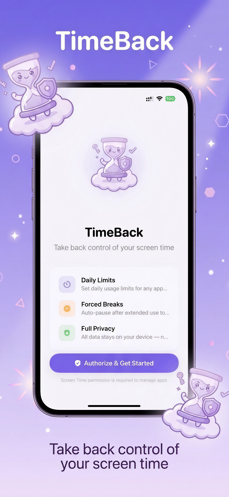
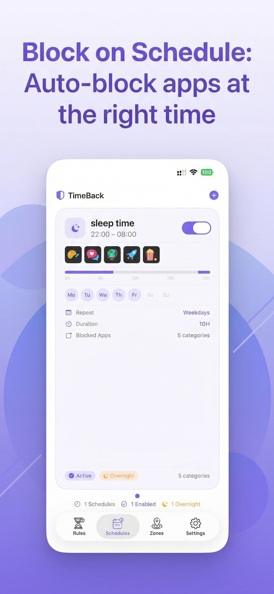
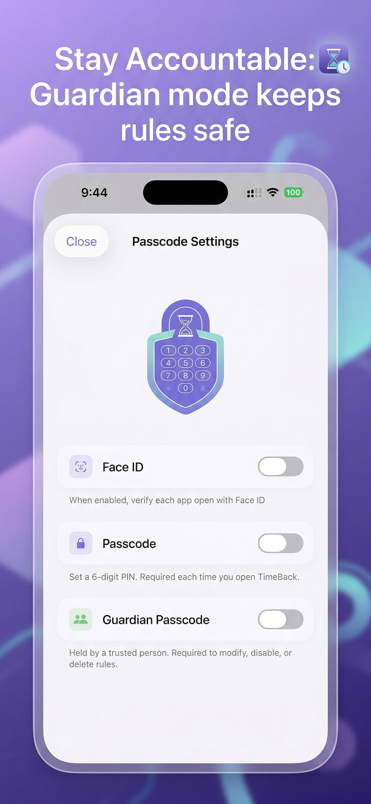

# TimeBack — Built Entirely with AI

> An iOS screen time management app built from scratch using **Claude Code** — no manual coding.

<p align="center">
  
  
  
  
</p>

---

## Screenshots

<p align="center">
  
  
  
  
  
  
</p>

---

## What is This?

This repository contains the **complete build plan and prompt collection** used to create TimeBack — a production-ready iOS app with 57 Swift files, 6 extension targets, 7-language localization, and zero third-party dependencies.

**This is NOT a code repository.** Instead, it's a reproducible blueprint that anyone can follow with Claude Code (or similar AI tools) to build the same app.

---

## What TimeBack Does

TimeBack helps users manage their screen time using Apple's official Screen Time API:

| Feature | Description |
|---------|-------------|
| **Daily Limits** | Set per-app usage limits with per-weekday customization |
| **Break Mode** | Force breaks after continuous usage |
| **Schedules** | Block apps during time periods (supports overnight) |
| **Geofences** | Block apps when entering locations (school, office) |
| **On-Demand Access** | Configurable "Continue for X minutes" on block screen |
| **Custom Shield** | Personalized blocking screen (icon, text, unlock method) |
| **Guardian Mode** | Separate passcode held by parent/partner |
| **Widget** | Home screen widget showing rule status |
| **7 Languages** | EN, ZH-Hans, ZH-Hant, JA, KO, FR, DE |

---

## Repository Structure

```
docs/
├── README.md           ← You are here
├── BUILD_PLAN.md       ← Complete technical architecture & milestone breakdown
├── PROMPTS.md          ← The exact prompts used, in order
├── privacy-policy.md   ← App Store privacy policy
└── terms-of-use.md     ← App Store terms of use
```

---

## How to Use This

### Prerequisites

- Mac with Xcode 16+
- Apple Developer Account (with FamilyControls capability)
- Claude Code (or Claude API access)
- Physical iOS device (Screen Time API doesn't work on Simulator)

### Steps

1. **Read `BUILD_PLAN.md`** — Understand the architecture, targets, and data flow
2. **Follow `PROMPTS.md`** — Execute prompts sequentially (Phase 1 → Phase 10)
3. **Test on device** — After each phase, build and test on a real iPhone
4. **Iterate** — Use the bug fix prompts when issues arise

### Estimated Timeline

| Phase | Effort | What You Get |
|-------|--------|-------------|
| Phase 1-2 | ~2 hours | Project setup + data models + rule engine |
| Phase 3 | ~1 hour | Dashboard UI with card carousel |
| Phase 4 | ~1 hour | Custom Shield extensions |
| Phase 5 | ~2 hours | Schedules + Geofences |
| Phase 6 | ~1 hour | Settings + Passcode + Guardian |
| Phase 7 | ~30 min | Widget |
| Phase 8 | ~1 hour | Usage data pipeline |
| Phase 9 | ~2 hours | 7-language localization |
| Phase 10 | ~1 hour | App Store preparation |
| **Total** | **~12 hours** | **Production-ready app** |

---

## Technical Highlights

### Architecture Decisions

| Decision | Why |
|----------|-----|
| **App Group JSON files** (not UserDefaults) | UserDefaults has in-process cache — extensions don't see main app writes |
| **Serial DispatchQueue** for DeviceActivity | XPC calls block 1-3 sec, must not freeze UI |
| **Foundation extensions** (not ExtensionKit) for Monitor/Shield | More reliable system discovery on dev-signed builds |
| **Per-weekday limit events** | DeviceActivity doesn't support dynamic thresholds — register 7 events, filter by today |
| **Checkpoint-based usage tracking** | Report extension fails on dev builds — fallback via Monitor checkpoints every 30 min |
| **No UserDefaults for cross-process data** | The biggest "gotcha" — UserDefaults doesn't sync across processes reliably |

### Known iOS Limitations

| Limitation | Workaround |
|------------|-----------|
| Shield UI is system-rendered (no custom SwiftUI) | Use ShieldConfiguration to customize text/icon/buttons |
| DeviceActivityReport fails on dev-signed builds | Checkpoint fallback via Monitor extension |
| FamilyControls: only 1 app at a time can have authorization | Document requirement for users |
| DeviceActivity events have 1-3 min delivery delay | Don't rely on exact timing for limit enforcement |
| ManagedSettings shield applies to ALL apps in a rule | Guide users to create separate rules for per-app limits |

---

## Bug Fixes Included

The prompt collection includes solutions for 23+ bugs discovered during development:

- Shield extension not loading (wrong NSExtensionPointIdentifier)
- Guardian passcode not triggering (SwiftUI environment propagation)
- Duplicate notifications on rule edit (dedup guard)
- Map crash on zone dismiss (Metal resource cleanup)
- Data race on MainActor-isolated property (read from disk instead)
- Midnight reset clearing ALL rules state (scoped per-rule)
- Grace period extension by repeated taps (timer no-overwrite)
- Ghost card state on guardian cancel (snap back before challenge)
- And more...

---

## Stats

| Metric | Value |
|--------|-------|
| Swift files | 57 |
| Lines of code | ~15,000 |
| Extension targets | 5 |
| Localization keys | 530+ |
| Languages | 7 |
| Third-party dependencies | 0 |
| Bugs found & fixed | 23+ |
| Development sessions | ~5 |
| Build with Claude Code | 100% |

---

## License

The build plan and prompts are released under **MIT License** — use them freely to build your own screen time management app.

---

## Support

- **Privacy Policy**: [vrk176.github.io/TimeBack/privacy-policy](https://vrk176.github.io/TimeBack/privacy-policy)
- **Terms of Use**: [vrk176.github.io/TimeBack/terms-of-use](https://vrk176.github.io/TimeBack/terms-of-use)
- **Contact**: geejy93@gmail.com

---

*Built with [Claude Code](https://claude.ai/code) — proving that AI-assisted development can produce production-quality iOS apps.*
